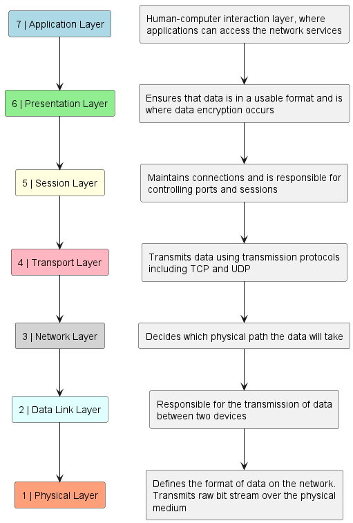

# Networking

Let's address each of your questions:

## Inter-VLAN Routing

What is inter VLan routing?

- Inter-VLAN routing refers to the process of forwarding traffic between different VLANs (Virtual Local Area Networks) within a network. VLANs are used to logically segment a single physical network into multiple virtual networks, allowing for better organization, security, and traffic management.
- Inter-VLAN routing is typically performed by a router or layer 3 switch that has interfaces configured for each VLAN and the ability to route traffic between them. This allows devices in different VLANs to communicate with each other, even though they are logically separated.
- Inter-VLAN routing can be achieved through traditional router interfaces, router sub-interfaces, or VLAN interfaces on layer 3 switches.

## Ethernet

What is the ethernet and how does it work?

- Ethernet is a widely used networking technology for connecting devices within a local area network (LAN). It operates at the Data Link Layer (Layer 2) and is defined by the IEEE 802.3 standard.
- Ethernet uses a method called Carrier Sense Multiple Access with Collision Detection (CSMA/CD) for media access control. Devices on an Ethernet network listen to the network before transmitting data to avoid collisions. If a collision occurs, devices use a backoff algorithm to retransmit data after a random delay.
- Ethernet frames encapsulate data for transmission over the network. Each frame includes a destination MAC address, a source MAC address, and a type field that identifies the upper-layer protocol (such as IP or IPv6).
- Ethernet networks can use various physical media, including twisted-pair copper cables (e.g., Ethernet over twisted pair, commonly referred to as Ethernet cables), fiber optic cables, and wireless technologies (e.g., Wi-Fi).

## Network Layers

### Difference between layer 2 and layer 3

- Layer 2 (Data Link Layer) and Layer 3 (Network Layer) are different layers of the OSI (Open Systems Interconnection) model, each serving distinct functions in networking.
- Layer 2 is responsible for data encapsulation into frames, addressing (using MAC addresses), and media access control. Ethernet operates at Layer 2.
- Layer 3 is responsible for logical addressing (using IP addresses), routing, and packet forwarding between different networks. IP (Internet Protocol) operates at Layer 3.
- Layer 2 is necessary for local network communication within the same subnet or VLAN, as it provides the necessary addressing and data link services for devices to communicate directly with each other.
- Layer 3 becomes necessary when communication needs to occur between different networks or subnets, as it enables routing and forwarding of packets between networks based on IP addresses.

> OSI Model

## Different Network Threats and How They Come About

- Network threats include various types of malicious activities aimed at disrupting, intercepting, or gaining unauthorized access to network resources and data.
- Common network threats include:
  - **Malware**: Malicious software, such as viruses, worms, trojans, and ransomware, that can infect devices and networks.
  - **Denial of Service (DoS) Attacks**: Attempts to overwhelm a network or server with excessive traffic, rendering it unavailable to legitimate users.
  - **Man-in-the-Middle (MitM) Attacks**: Intercepting and eavesdropping on communication between two parties without their knowledge.
  - **Phishing**: Deceptive emails, websites, or messages used to trick users into revealing sensitive information, such as login credentials or financial details.
  - **Spoofing**: Impersonating a legitimate entity or device on the network to gain unauthorized access or deceive users.
- Network threats can come about through various means, including vulnerabilities in network devices and protocols, insecure configurations, social engineering tactics, and exploitation of software vulnerabilities.
- Effective network security measures, such as firewalls, intrusion detection/prevention systems, encryption, access controls, and security awareness training, are essential for mitigating network threats and protecting network assets and data.

Understanding these concepts is crucial for building and maintaining secure and efficient networks. If you have any further questions or need clarification on any topic, feel free to ask!
